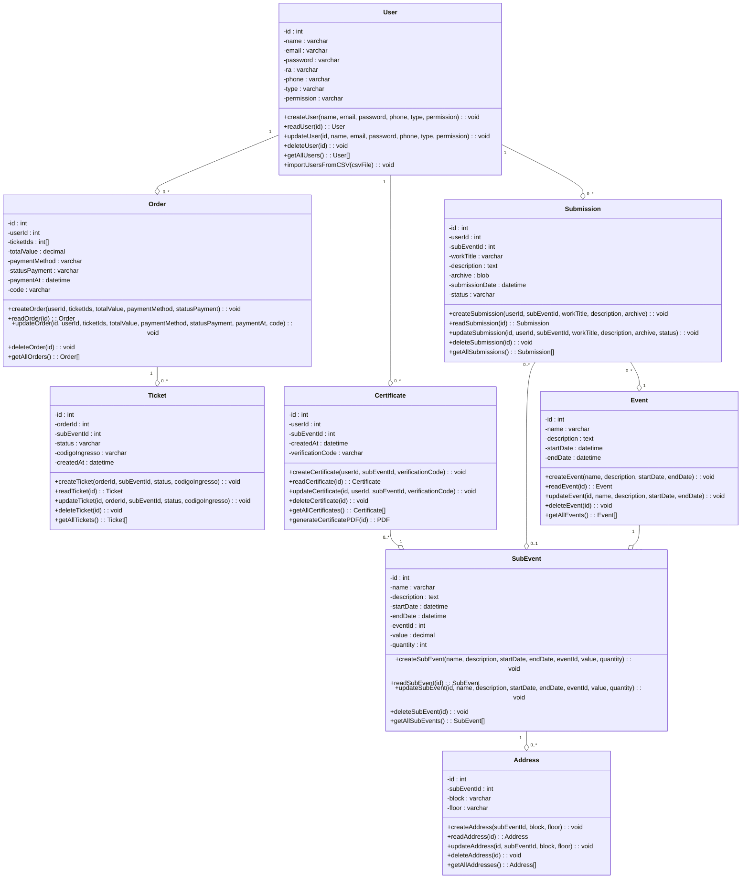
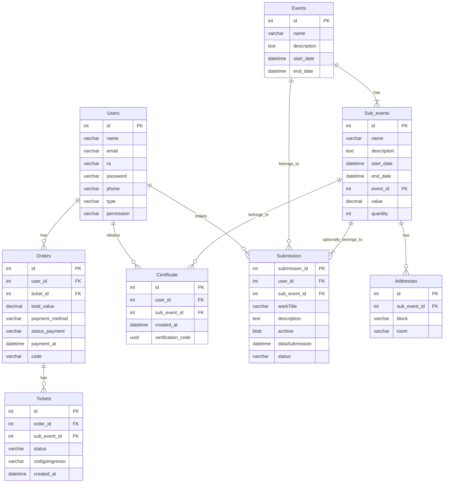

<h1 align="center"> UNICAP EVENTS</h1>


## rodar migrations
``` 
    npm run knex migrate:latest
```

## apagar todas as migrations (PRECISA DE PERMISÃO PRA USAR)
``` 
    npm run knex migrate:rollback --all
```

## rodar seeders
``` 
    npm run knex seed:run 
```

## Classes e funções 



## Tabelas 


